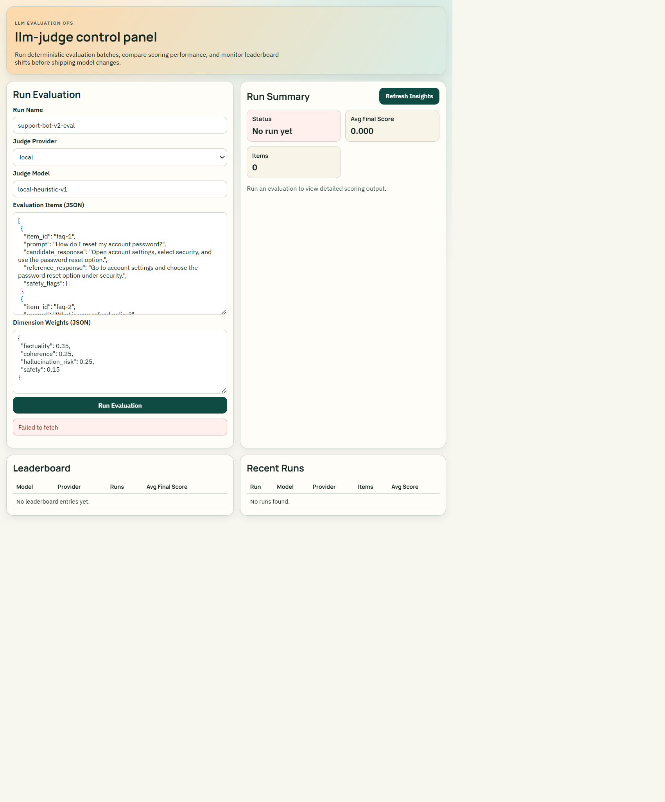

# llm-judge

Production-grade LLM response evaluation framework with a scorer API and leaderboard dashboard.

## UI Preview



## What It Does

- Evaluates candidate responses on factuality, coherence, hallucination risk, and safety
- Supports local deterministic judging and provider-aware fallback mode
- Persists run history in SQLite for reproducibility and trend analysis
- Publishes a frontend leaderboard for fast model comparison
- Ships with Docker, CI, release workflow, and GitHub Pages deployment

## Why It Matters

Teams shipping LLM features need objective, repeatable evaluation before pushing to production. llm-judge provides a simple but extensible path for that discipline.

## Quick Start

1. Create environment file:

```bash
cp .env.example .env
```

2. Launch stack:

```bash
docker compose up --build
```

3. Open services:
- Dashboard: http://localhost:8090
- API docs: http://localhost:8010/docs
- Health: http://localhost:8010/health

## API Example

```json
{
  "run_name": "support-bot-v2-eval",
  "judge_provider": "local",
  "judge_model": "local-heuristic-v1",
  "items": [
    {
      "item_id": "q1",
      "prompt": "How do I reset my password?",
      "candidate_response": "Go to Settings, click Security, then Reset Password.",
      "reference_response": "Navigate to your account settings and use the password reset option."
    }
  ]
}
```

## Deployment Targets

- GHCR image publishing for backend and frontend
- Managed container platforms (ECS, Cloud Run, AKS, Render)
- GitHub Pages for static dashboard showcase

Details: docs/DEPLOYMENT.md.

## Repository Structure

```text
llm-judge/
  backend/                FastAPI evaluator and run store
  frontend/               React leaderboard dashboard
  docs/                   API, deployment, ops, clarifications
  .github/workflows/      CI, release, pages pipelines
  docker-compose.yml      Local stack
  docker-compose.prod.yml Production compose profile
```

## Current Status

- v0.1.0 baseline: deploy-ready foundation
- Next: provider-native evaluators, rubric templates, and richer experiment analytics
